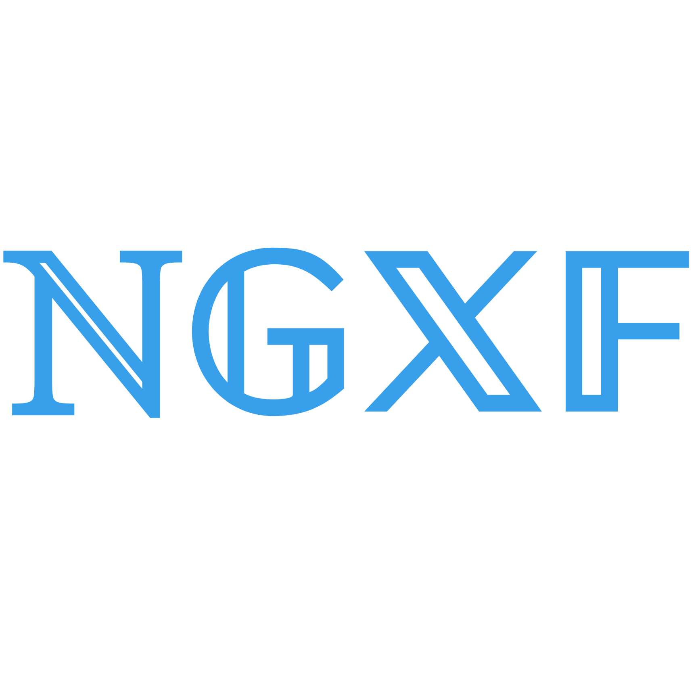

  
   
  NGXF is a non-state management pattern + library for Angular
   
   
   

## :interrobang: What is NGXF?
NGXF is a non-state management pattern + library for Angular. It acts as a multiple source of
truth for your application's state, providing simple rules for predictable state mutations.

NGXF is modeled after the CQRS pattern popularly implemented in libraries like Redux, NGRX and NGXS
but reduces boilerplate by using modern HTML features such as templates and directives.

## 👋 New to NGXF?
If you're just getting started with NGXF, I recommend you head over to the [concepts](concepts/intro.md)
and then explore the rich ecosystem of examples in the [community resources](community/projects.md) page.

## ❓ Need Help?
For questions, please ask them on Stack Overflow with the `ngxf` tag:
https://stackoverflow.com/questions/ask?tags=ngxf

To chat with other users and contributers join us on Telegram: https://t.me/ngSoviet

If you think there is a bug in this library, you can open an issue on GitHub (https://github.com/ngxf/platform/issues/new). If possible a link to a http://stackblitz.com (or github) repo with a repro or a failing test would be great.

## ❤️ Giving Back
Become a [Contributor](community/contributors.md) or a [Sponsor](community/sponsors.md).

